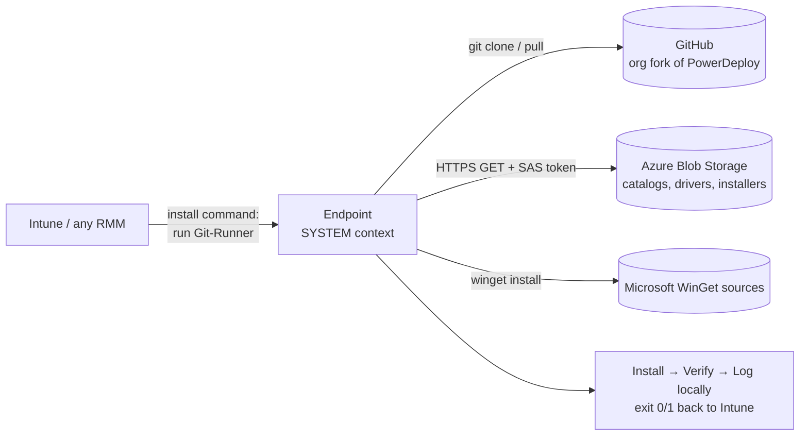

# PowerDeploy Architecture

**Status of this document:** Accurate as of 2026-07-06 (verified against commit `9f92734`). This is the canonical architecture reference for PowerDeploy. It is written for three audiences at once: engineers extending the system, IT administrators at adopting organizations (including security reviewers), and AI assistants helping with deployment, troubleshooting, or development. Where the code and this document disagree, the code is correct and this document has a bug — please fix it in the same commit that changes the behavior.

> **Maintenance rule:** any change to a JSON schema, the registry contract, an exit-code convention, or an execution flow MUST update this document in the same pull request.

---

## 1. What PowerDeploy is

PowerDeploy is a PowerShell-based deployment system that installs and manages **applications and network printers** on Windows endpoints — without a print server, and without packaging payloads into Intune.

The one-sentence mental model:

> **Intune (or any RMM) is only the ignition. GitHub is the engine. Azure Blob Storage is the parts warehouse. The endpoint itself does all the work.**

### What PowerDeploy is NOT

These misconceptions come up repeatedly, so they are stated explicitly:

- **There is no cloud compute.** Nothing executes in Azure or anywhere else in the cloud. The only cloud interactions in the entire codebase are (a) HTTPS `GET` requests for files in Azure Blob Storage, and (b) `git clone`/`git pull` against GitHub.
- **There is no server.** No service to patch, back up, or fail over. The failure domain of any operation is a single endpoint.
- **There is no agent.** Nothing is resident on endpoints except the cloned script repository, logs, and the standard Windows/Intune infrastructure the org already runs.
- **There is no telemetry.** Results exist as exit codes (consumed by Intune) and log files on each machine. Nothing phones home.
- **It does not touch security software.** No Defender/AV configuration is read or modified anywhere. (The logging function retries file appends specifically to *coexist* with EDR file scanning.)

---

## 2. The core mechanism: the Runner pattern

Every Intune "Win32 app" PowerDeploy creates contains exactly **one file**: `Git-Runner_TEMPLATE.ps1`, wrapped in a `.intunewin` package. The real payload is never inside the package.

At install time on the endpoint (running as SYSTEM), Git-Runner:

1. Decodes its parameters (Base64-encoded JSON — see §5.4).
2. Installs Git for Windows if missing (serialized fleet-wide by a global named mutex `Global\PowerDeploy_GitInstall`, with abandoned-mutex recovery, because concurrent Autopilot ESP installs once raced each other).
3. Clones or updates the organization's PowerDeploy repository into the working directory (`C:\ProgramData\PowerDeploy--<MODE>\PowerDeploy-Repo`), stashing local drift, switching branch if requested.
4. Ensures the `HKLM\SOFTWARE\PowerDeploy` registry key exists.
5. Runs `Other_Tools\Security_Manager.ps1` to enforce strict ACLs on the working folders and the registry key (see §7).
6. Executes the requested repo script (e.g. `Installers\General_JSON-App_Installer.ps1`) with the decoded parameters.
7. Reports the child script's exit code (0/1) back to Intune, after a second Security Manager pass.



**Why this design (instead of packaging payloads into Intune):**

- **Fixing a deployment bug never requires repackaging.** The `.intunewin` is a constant; a `git push` to the org fork changes what every endpoint runs on its next attempt. Iteration time drops from "repackage, re-upload, wait for Intune" to "commit."
- **Delivery is observable.** Intune's content delivery is a black box; a git pull plus an HTTPS download plus a local transcript is not. Every step of every install is in a plain-text log on the machine.
- **Any delivery channel works.** Anything that can run one PowerShell script (Intune, Datto, CrowdStrike RTR, a tech's USB stick) becomes a full deployment channel. Intune is the *default* ignition, not a dependency.

The generated install command has this exact shape (one line):

```
%SystemRoot%\Sysnative\WindowsPowerShell\v1.0\powershell.exe -NoProfile -ExecutionPolicy Bypass
  -Command "& '.\Git-Runner_TEMPLATE.ps1' -RepoNickName 'PowerDeploy-Repo' -RepoUrl '<org fork URL>'
  -WorkingDirectory 'C:\ProgramData\PowerDeploy--<MODE>' -ScriptPath '<repo-relative script>'
  -ScriptParamsBase64 '<Base64(UTF8(JSON))>'"
```

`Sysnative` is deliberate and load-bearing: it escapes Intune's 32-bit management-extension context into 64-bit PowerShell. Do not "simplify" it away.

---

## 3. System components

| Path | Role | Notes |
|---|---|---|
| `Setup.ps1` (+ `Setup_RUNNER.bat`) | The interactive console for humans. Two audiences in one menu: technicians installing/removing assets locally, and admins preparing Intune deployments and org configuration. | 100% interactive (`Read-Host`); one menu action per launch. The menu is generated by reflection over function names containing `--` (see §5.6). |
| `Templates\Git-Runner_TEMPLATE.ps1` | The runner (§2). The only file that lives *outside* the repo at run time — it is what fetches the repo. | Despite the name, this is live production code, not an example. |
| `Installers\General_JSON-App_Installer.ps1` | App orchestrator: resolves an app name against the catalogs and dispatches to an install engine. | Entry point for both Setup.ps1 and Intune app installs. |
| `Installers\General_IP-Printer_Installer.ps1` | Printer orchestrator: resolves a printer against `PrinterData.json`, stages the driver from blob storage (`pnputil`), creates the TCP/IP port, installs the printer. | |
| `Installers\General_{WinGet,MSI,EXE,URL_DL}_Installer.ps1` | The four install engines. Shared shape: pre-check → detect (skip if present) → install with timeout → **verify by re-detection** → exit 0/1. | The EXE engine fingerprints installer frameworks (Inno/NSIS/InstallShield/WiX Burn/…) to choose silent switches. |
| `Installers\Install-WinGet.ps1` | WinGet locate/repair/bootstrap engine (works under SYSTEM). | |
| `Installers\InstallApp-*-FullClean.ps1` | App-specific "recipes" (MS Office via ODT, Dell Command Update): uninstall-then-reinstall clean flows invoked via the `Custom_Script` install method. | |
| `Uninstallers\General_Uninstaller.ps1` | Universal uninstaller: ~13 removal methods (`Remove-App-*` functions) or `All`; verdict comes from re-detection, never from uninstaller exit codes. | |
| `Uninstallers\Uninstall-Printer.ps1` | Printer + port removal with WMI fallback, detection-bracketed. | |
| `Configurators\Configure-Registry.ps1` | The single registry engine: `Read`, `Read-All`, `Backup`, `Modify`, `Lockdown`. Underpins the entire org-config mechanism (§4). | The most security-mature code in the repo (idempotent ACL lockdown, backup-before-change, verify-after-write). |
| `Templates\OrganizationCustomRegistryValues-Reader_TEMPLATE.ps1` | Reads the seven org-config registry values into a hashtable for every consumer. | **Live production dependency** invoked by Setup.ps1 and four installers — the `_TEMPLATE` suffix refers to the hand-edited mapping block inside it, not to the file being an example. |
| `Templates\Detection-Script-Application_TEMPLATE.ps1` / `Detection-Script-Printer_TEMPLATE.ps1` | Detection scripts (Intune-compatible exit-code contract, §5.5). The app detector embeds a self-contained WinGet repair engine so detections work without the repo present. | |
| `Templates\General_RemediationScript-Registry_TEMPLATE.ps1` | Dual-mode Detect/Remediate engine for registry state — the endpoint side of org-config delivery and SAS-key rotation (§6.4). | |
| `Other_Tools\Generate_Install-Command.ps1` | The artifact factory: builds the Base64-parameterized install/uninstall/detect commands and the org-config remediation script pair. Called by Setup.ps1's wizards. | |
| `Other_Tools\Generate_Custom-Script_FromTemplate.ps1` | Produces self-contained, parameter-stamped copies of Git-Runner (for pasting into Intune script fields). | |
| `Other_Tools\Security_Manager.ps1` | ACL enforcer for endpoint folders and the registry key (§7). **It does not manage keys or secrets** despite the name. | |
| `Other_Tools\Export-PrinterServer-CSV.ps1` | Exports an existing print server's printers to CSV. The matching *importer* (CSV → `PrinterData.json`) is planned but does not exist yet. | |
| `Downloaders\DownloadFrom-AzureBlob-SAS.ps1` | The production blob download path (SAS-token URL). | |
| `Downloaders\DownloadFrom-AzureBlob-AADauth.ps1` | Prototype of a SAS-less future (Entra ID auth). Interactive-only, refuses SYSTEM — **not production-ready**; kept as the designed exit ramp from SAS keys. |
| `Templates\ApplicationData_TEMPLATE.json` | **Doubles as the live public catalog** (§4.2) — the app orchestrator parses this file directly. |
| `Templates\PrinterData_TEMPLATE.json` | Example/starter for the org's private printer catalog. |
| `Templates\SearchAndDestroy_TEMPLATE.json` | Aspirational bulk-uninstall manifest. **No code consumes it yet.** |
| `Tests\General_Tester.ps1` | Interactive smoke-test menu. Real machine mutations, exit-code verification only — a manual harness, not an automated test suite. |

---

## 4. Configuration and data model

### 4.1 The registry contract (org identity)

The engine (the repo) is org-agnostic. Everything organization-specific lives in **seven registry values** on each endpoint, under `HKLM\SOFTWARE\PowerDeploy`:

| Subkey | Value | Meaning |
|---|---|---|
| `\General` | `StorageAccountName` | Azure storage account name (URI built as `https://<name>.blob.core.windows.net/...`) |
| `\General` | `CustomRepoURL` | The org's fork of this repository (used by PRIVATE/PRODUCTION deploy modes) |
| `\General` | `CustomRepoToken` | Optional Git PAT for a private fork (spliced into the clone URL as `https://oauth2:<token>@...`) |
| `\Applications` | `ApplicationContainerSASkey` | SAS token for the applications container |
| `\Applications` | `ApplicationDataJSONpath` | Blob path of the private app catalog, format `<container>/<blob path>` (split at the **first** `/`), e.g. `applications/ApplicationData.json` |
| `\Printers` | `PrinterContainerSASkey` | SAS token for the printers container |
| `\Printers` | `PrinterDataJSONpath` | Blob path of the printer catalog, e.g. `printers/PrinterData.json` |

- The key is ACL-locked to `SYSTEM` + `BUILTIN\Administrators` (FullControl, inheritance blocked, 64-bit registry view) by `Configure-Registry.ps1 -Function Lockdown`, re-asserted by Security Manager on every runner execution.
- This layout is currently defined in three places that must stay in sync by hand: the writer (`Generate_Install-Command.ps1` → `RegRemediationScript`), the reader (`OrganizationCustomRegistryValues-Reader_TEMPLATE.ps1`), and Setup.ps1's expectations. (Consolidating this into one schema is on the roadmap.)
- **Known gap:** the interactive config wizard currently collects only four of the seven values (`CustomRepoURL`, `CustomRepoToken`, and both SAS keys); `StorageAccountName` and the two JSON paths ship as parameter defaults in `Generate_Install-Command.ps1` and must be changed there by an adopting org until the wizard is extended.

**Why registry (and not a config file or cloud service):** values can be pushed fleet-wide through Intune Proactive Remediations (a channel every Intune org already has), read under SYSTEM with zero dependencies, ACL-protected at rest, and they survive repo re-clones. The same public engine code serves any org because the org's identity is data on the machine, not code in the repo.

### 4.2 Application catalog (`ApplicationData.json`)

Two catalogs exist:

- **Public catalog** = `Templates\ApplicationData_TEMPLATE.json` *inside the repo* — generic, broadly useful apps.
- **Private catalog** = the org's `ApplicationData.json` in blob storage — org-specific apps and private payloads.

Lookup is **sequential, public first**: the orchestrator searches the public catalog, and only on a miss downloads and searches the private one. *A public entry therefore shadows a same-named private entry* — org catalogs must not reuse public `ApplicationName`s. (This is a lookup order, not a merge.)

Top level: `{ "Applications": [ <entry>, ... ] }`

**Fields common to all entries:**

| Field | Required | Meaning / footguns |
|---|---|---|
| `ApplicationName` | yes (unique) | The primary key. Used for menu selection, `PreRequisites` references, and log filenames. |
| `InstallMethod` | yes | One of: `WinGet`, `MSI-Private-AzureBlob`, `EXE-Private-AzureBlob`, `URL_Download`, `Custom_Script`. (`MSI-Online` appears in dispatch but is an unimplemented stub — do not use.) |
| `DisplayName` | required whenever `MSI_Registry` detection applies | Matched as a **wildcard substring** (`-like "*<DisplayName>*"`) against both HKLM Uninstall hives. Too generic ⇒ matches sibling products; too specific ⇒ breaks on locale/edition changes. |
| `DetectMethod` | no | `WinGet`, `MSI_Registry`, `AppXpackage`, `AppXProvisionedPackage`, `CIM`, `All`. Auto-default: `WinGet` method ⇒ `WinGet`; every other method ⇒ `MSI_Registry`. |
| `UninstallType` | no | `All` (try every method until one verifies), `Remove-App-WinGet`, or the literal name of any `Remove-App-*` function in `General_Uninstaller.ps1`. |
| `PreRequisites` | no | Comma-separated list of other `ApplicationName`s, installed first. **Resolved one level deep only** — prerequisites of prerequisites are not installed. |
| `Version` | no | Exact version for WinGet install/detection. |

**Per-method fields:**

| InstallMethod | Fields |
|---|---|
| `WinGet` | `WinGetID` (required; exact WinGet or msstore ID). |
| `MSI-Private-AzureBlob` | `MSIPathFromContainerRoot` (required; **forward-slash** path; the blob must live in the *same container* as `ApplicationData.json`), `InstallArgs` (caution: replaces the **entire** msiexec argument string including `/i <path>` — usually leave unset). |
| `EXE-Private-AzureBlob` | `EXEPathFromContainerRoot` (required; same container rule), `InstallArgs`. |
| `URL_Download` | `DownloadURL` (required), `DownloadType` (`FILE` \| `ZIP`), `InstallType` (`MSI` \| `EXE`), `ExtractedPathFromDownloadRoot` (required for ZIP; forward-slash path to the installer inside the archive), `InstallArgs`, `ExpectedExitCodes` (optional; e.g. include `3010` for reboot-required installers). |
| `Custom_Script` | `ScriptPathFromRepoRoot` (required; repo-relative, JSON-escaped **backslashes**, e.g. `"Installers\\InstallApp-MS_Office-FullClean.ps1"`), `CustomScriptArgs` (raw parameter string — treated as code; see §7). |

> **Path convention warning:** blob paths use forward slashes; repo paths use escaped backslashes — *in the same file*. This is the most common first-authoring mistake.

**Load-bearing implementation detail:** the selected entry's JSON properties are converted **directly into PowerShell variables** by name (`Set-Variable` / `Set-VariablesFromObject`). The schema *is* the variable namespace. A misspelled field name silently creates a wrong-named variable and leaves the real one empty — there is currently no authoring-time validation. (JSON Schema files and a validator are the next roadmap item; until then, treat catalog edits with code-review discipline.)

### 4.3 Printer catalog (`PrinterData.json`)

Top level: `{ "printers": [...], "drivers": [...] }`

| `printers[]` field | Required | Meaning |
|---|---|---|
| `PrinterName` | yes (unique) | Exact-match key; becomes the installed Windows printer name and the detection target. |
| `PortName` | yes | TCP/IP port name. House convention: zero-padded dotted IP (`010.009.028.106`) so ports sort and deduplicate cleanly. Convention only — not validated. |
| `PrinterIP` | yes | The actual IP (`10.9.28.106`). |
| `PresetDriver` | no | Foreign key into `drivers[]`. If present, the driver entry's fields are used; if absent, the printer entry must carry `DriverName`/`INFFile`/`DriverZip` inline. |

| `drivers[]` field | Required | Meaning |
|---|---|---|
| `PresetDriver` | yes (unique key) | Convention: `VENDOR_UPD_PCL6_WIN_X64`. One driver definition serves any number of printers. |
| `DriverName` | yes | Must **exactly** match the driver name advertised inside the INF (e.g. `HP Universal Printing PCL 6`), or `Add-PrinterDriver` fails. |
| `INFFile` | yes | The `.inf` filename inside the driver zip. |
| `DriverZip` | yes | Container-relative forward-slash blob path to the driver zip, e.g. `printers/Drivers/HP/HP_Universal_Printing_PCL_6/upd-pcl6-x64-7.9.0.26347.zip`. |

Install sequence on the endpoint: download zip via SAS → extract to `<zip>-EXTRACTED` → `pnputil /add-driver` (run from inside the extracted folder — a deliberate workaround for pnputil path-length/quoting failures; preserve in any rewrite) → `Add-PrinterDriver` → `Add-PrinterPort` (an existing port of the same name is **reused as-is**, its IP is not corrected) → `Add-Printer` → verify by re-detection.

### 4.4 Endpoint file layout

Everything lives under the **working directory**, `C:\ProgramData\PowerDeploy--<MODE>` (see §6.5 for modes):

```
C:\ProgramData\PowerDeploy--PRODUCTION\
├── PowerDeploy-Repo\          # the git clone (the engine)
├── TEMP\
│   └── Downloads\             # blob payloads, catalogs; "<zip>-EXTRACTED" folders
└── Logs\
    ├── Setup_Logs\  Git_Logs\  Installer_Logs\  Uninstaller_Logs\
    ├── Detection_Logs\  Config_Logs\  Download_Logs\  Security_Logs\
    └── Generator_Logs\  Repair_Logs\  Other_Logs\
```

Log files are named `<ScriptName>.<Qualifier>._Log_<yyyyMMdd_HHmmss>.log`; entries are `[timestamp] [LEVEL] message` with levels `INFO / INFO2 / WARNING / ERROR / SUCCESS / DRYRUN`. Appends use a 5-attempt retry loop specifically to coexist with CrowdStrike/Defender file scanning.

On the **admin workstation**, Setup.ps1's wizards emit artifacts to sibling folders of the repo: `Temp\IntuneWin_Output\<timestamp>\` (packages), `TEMP\Intune_Install-Commands_Output\` (command `.txt` files, also copied to clipboard), `TEMP\Custom_Scripts_Output\` (stamped runner scripts).

### 4.5 Exit-code contract

This contract is the API between every component (and between PowerDeploy and Intune):

- Every script: `0` = success, `1` = failure. Nothing else is meaningful.
- **Detection scripts:** `0` = **detected / present**, `1` = not detected. (So uninstall verification succeeds on a *nonzero* detection result.)
- The MSI/EXE engines treat `3010` (reboot required) as success; the URL engine defaults to `0` only unless the catalog entry supplies `ExpectedExitCodes`.
- "Already installed" exits `0` (installs are idempotent). "Was never installed" exits `0` from the uninstaller (removals are idempotent). This is deliberate: Intune retries safely.

### 4.6 The RegistryChanges wire format

Org-config delivery squeezes structured data through Intune's parameter plumbing using a small bracketed DSL (this exists because Intune mangles nested quoting):

```
'[-KeyPath "HKEY_LOCAL_MACHINE\SOFTWARE\PowerDeploy\General" -ValueName "StorageAccountName" -ValueType "String" -Value "<name>"],[...],[...]'
```

Split on `],[` boundaries; four `-Param "value"` pairs per group; doubled quotes (`""`) escape a literal quote. Generated by `Generate_Install-Command.ps1`, parsed by `General_RemediationScript-Registry_TEMPLATE.ps1`. Humans should never hand-author this — Setup.ps1 generates it.

---

## 5. Execution flows

### 5.1 Intune-deployed install (the production path)

1. Admin assigns the Win32 app (payload: Git-Runner only) to a device group.
2. Intune runs the **detection script** (a parameter-stamped Git-Runner copy targeting the detection template). Exit 1 ⇒ not installed ⇒ proceed.
3. Intune runs the install command (§2). Git-Runner clones/updates the org fork, locks down ACLs, and executes the target orchestrator with Base64-decoded parameters.
4. The orchestrator resolves the asset in the catalogs, dispatches to an engine, installs, **verifies by re-detection**, and exits 0/1.
5. Git-Runner propagates the exit code to Intune. Full transcripts of every step are in `Logs\` on the endpoint.

### 5.2 Creating an Intune deployment (admin, via Setup.ps1)

1. Run `Setup_RUNNER.bat` as admin → pick `Printer--InTune-Setup` or `WindowsApp--InTune-Setup`.
2. Choose a **deploy mode** (§6.5) — this decides which repo/branch the deployed asset will pull from forever.
3. Ensure the asset exists in the catalog (today: hand-edit the JSON in the Azure portal blob editor, guided by console instructions — tooling for this is the top roadmap item).
4. The wizard packages Git-Runner into a `.intunewin` (downloading Microsoft's `IntuneWinAppUtil.exe` on first use), generates the install/uninstall command `.txt` files and the detection script.
5. The wizard prints a step-by-step Intune portal walkthrough (app name conventions: `APP: <name> [<mode>]` / `PRINTER : <name> [<mode>]`; install behavior **System**; custom detection script; assignments). The admin transcribes these into the portal by hand.

**Why manual portal steps instead of Graph API automation:** PowerDeploy deliberately holds **zero standing cloud credentials**. It cannot modify the Intune tenant or the storage account; a human with their own portal rights performs every tenant-affecting change. This keeps the tool's blast radius at "one endpoint + whatever a read-only SAS exposes" and keeps the security review small. The cost is manual transcription; the roadmap answer is better generated artifacts, not tenant credentials.

### 5.3 Technician local install (endpoint, via Setup.ps1)

1. Run `Setup_RUNNER.bat` as admin (as the logged-in user — WinGet misbehaves otherwise) → pick `Printer--Install-Local` or `WindowsApp--Install-Local`.
2. Setup.ps1 reads the seven org values from the registry, downloads the catalog(s) from blob storage via SAS, and shows a numbered pick list.
3. The chosen asset installs through exactly the same orchestrators and engines Intune uses — one catalog, no drift between "what techs can install" and "what Intune deploys."

### 5.4 Org-config seeding and SAS rotation

1. Admin generates container SAS tokens in the Azure portal (read-only, HTTPS-only, expiry per org policy).
2. `Setup.ps1` → `Registry_Remediations--InTune-Setup` collects the values (keep / replace / CLEAR semantics per value).
3. `Generate_Install-Command.ps1 -DesiredFunction RegRemediationScript` emits a **Detect + Remediate script pair** (Git-Runner-wrapped): Detect exits 1 if any of the seven registry values mismatch; Remediate writes them (with ACL lockdown) and re-verifies.
4. Admin uploads the pair to Intune **Proactive Remediations** ("Run in 64-bit PowerShell: Yes") — or, alternatively, packages the Remediate script as a Win32 app (both channels deliver the same generated script).
5. **Rotation = re-run this flow with new SAS values.** Endpoints converge on the next remediation cycle. (A thin UI over this generator is roadmap idea #4; the backend already exists.)

### 5.5 Detection and verification model (the reliability core)

The design signature of PowerDeploy is **detect → act → re-detect**:

- Before acting: if the asset is already present (install) or already absent (uninstall), exit 0 immediately.
- After acting: the verdict comes **exclusively from re-detection** (registry display names, `winget list`, printer presence, AppX queries) — *never* from the installer/uninstaller's own exit code, which experience shows can lie in both directions. The WinGet engine even retries detection up to 15 times because "sometimes it installs anyway despite returning an error."
- Consequence for operators and tooling: **exit 0 means "the desired state is verifiably true,"** not "a command returned 0."

Detection methods (`DetectMethod`): `WinGet` (winget list by exact ID), `MSI_Registry` (wildcard DisplayName in both Uninstall hives), `AppXpackage`, `AppXProvisionedPackage`, `CIM` (Win32_Product — **avoid**: querying it triggers MSI reconfiguration side effects), `All` (first success wins).

### 5.6 Setup.ps1's menu mechanics (for maintainers)

The main menu is built by **reflection**: `Get-Command -Name "*--*"` — any function whose name contains a double dash is auto-listed alphabetically. The `-zz-` infix (instead of `--`) is the convention for *hiding* unfinished functions from the menu. Consequences: menu numbering changes whenever functions are added/renamed (screenshots and runbooks rot), and any new helper containing `--` becomes a menu item. Treat function naming as a public interface.

---

## 6. Deployment modes

`Set-URL` (asked at the start of every Intune wizard) binds the deployed asset to a repo+branch, and isolates artifacts per mode in separate working directories so test and production coexist on one machine:

| Mode | Repo | Branch | Endpoint working directory |
|---|---|---|---|
| `PUBLIC-DEVELOPMENT` | Official public repo | `dev` | `C:\ProgramData\PowerDeploy--PUBLIC-DEVELOPMENT` |
| `PUBLIC-TESTING` | Official public repo | `main` | `C:\ProgramData\PowerDeploy--PUBLIC-TESTING` |
| `PRIVATE-DEVELOPMENT` | Org fork (`CustomRepoURL`) | `dev` | `C:\ProgramData\PowerDeploy--PRIVATE-DEVELOPMENT` |
| `PRODUCTION` | Org fork (`CustomRepoURL`) | `main` | `C:\ProgramData\PowerDeploy--PRODUCTION` |

Production deployments should always use mode 4: the org fork's `main` is the org's change-controlled deployment surface.

---

## 7. Trust and security model

### 7.1 The trust boundary, stated plainly

> **Write access to the org's fork (and to the blob containers) is equivalent to SYSTEM code execution on every enrolled endpoint.**

Endpoints pull and execute the fork's branch on every run. The catalog JSONs are similarly executable in effect (`Custom_Script` entries name scripts and arguments). Therefore: the fork and the storage containers must be protected like deployment credentials — branch protection, minimal write access, reviewed merges. Adopting organizations must hear this sentence in exactly this form.

*Current state:* endpoints track branch **HEAD** (no commit pinning, no signed commits/scripts). Release tags + endpoint pinning are on the roadmap to convert this from "trust our repo hygiene" to "endpoints run reviewed releases."

### 7.2 Secrets inventory

| Secret | Where it lives | Protection |
|---|---|---|
| Container SAS tokens (2) | `HKLM\SOFTWARE\PowerDeploy` on every endpoint | Registry ACL: SYSTEM + Administrators only, inheritance blocked. Tokens should be generated **read-only, HTTPS-only, with expiry** — note this is convention; nothing validates a pasted token's scope. |
| `CustomRepoToken` (Git PAT, optional) | Same registry key; also embedded in generated install commands and `.git/config` on endpoints | Same ACL. Prefer a public(ly readable) fork or a fine-grained, read-only PAT. |
| Both, in transit to endpoints | Inside generated Intune remediation scripts / install commands (Base64 of JSON — **encoding, not encryption**) | Intune script bodies are visible to Intune admins; treat accordingly. |

**Known gap (fix in progress):** several scripts currently echo SAS tokens and the PAT into console output and local log files. Log/temp folders are ACL-locked to admins on endpoints, which mitigates but does not excuse this; masking secrets in all log paths is a committed near-term fix. Security reviewers should assume logs may contain secrets until that lands.

Threat model honesty: any **local administrator** on an endpoint can read the SAS tokens by design. The tokens should therefore be scoped as low-value credentials: read-only access to installer files, rotated on schedule via §5.4. A leaked read-only SAS exposes private installer payloads and catalogs — not tenant credentials, not student data, not write access.

### 7.3 Endpoint hardening the tool performs

- `Security_Manager.ps1` runs before **and** after every runner execution: enforces strict ACLs (SYSTEM + Administrators FullControl only, inheritance blocked, SID-based checks that survive localization) on the repo clone, `TEMP`, `Logs`, and `C:\ProgramData\Microsoft\IntuneManagementExtension\Logs` (the latter because Intune's own logs can contain deployment parameters), plus the registry key. Fail-closed: an ACL failure fails the deployment.
- `Configure-Registry.ps1` backs up (reg export) before modifying, verifies after writing, and locks down keys it creates.

### 7.4 Execution posture (what a security review will ask)

- Scripts are **unsigned**; every generated command runs `-ExecutionPolicy Bypass`; the Intune walkthrough sets "Enforce script signature check: No". This is the standard shape for script-based deployment tooling, but it means adopting orgs must allow-list PowerDeploy's behavior patterns in their EDR (PowerShell spawning PowerShell with Bypass, git clones as SYSTEM, runtime downloads of git/winget bootstrappers). SCCOE runs it under CrowdStrike + Defender; the codebase contains coexistence scar tissue (log-append retries, the git-install mutex) and **never touches AV/EDR configuration**.
- Download integrity is currently transport-level only (HTTPS): no hash pinning on payloads, drivers, or bootstrap tools (git-for-windows "latest", `IntuneWinAppUtil.exe`, winget bundles). Checksum fields in the catalogs and pinned bootstrap versions are roadmap items.
- `Invoke-Expression` is used at two seams (Git-Runner's target invocation; `Custom_Script` args) — another reason catalog/repo write access must be treated as code execution (§7.1).

### 7.5 What the tool never does

No cloud writes of any kind (no Graph, no Azure management APIs, no storage writes). No standing credentials beyond the read-only SAS. No inbound listeners. No data collection or exfiltration; logs stay on the machine. No student/user data — the tool handles printers and applications only.

---

## 8. Network requirements (egress allow-list)

Endpoints (SYSTEM context) need HTTPS egress to:

| Destination | Purpose |
|---|---|
| `<StorageAccountName>.blob.core.windows.net` | Catalogs, private payloads, printer drivers (SAS GET) |
| `github.com`, `api.github.com`, `codeload.github.com`, `objects.githubusercontent.com` | Repo clone/pull; git-for-windows installer; winget msixbundle fallback |
| `aka.ms`, `*.delivery.mp.microsoft.com`, `cdn.winget.microsoft.com`, `storeedgefd.dsx.mp.microsoft.com` | WinGet bootstrap and package sources (incl. msstore) |
| `www.powershellgallery.com`, `onegetcdn.azureedge.net` | WinGet-install fallback module, NuGet provider |
| Vendor URLs named in `URL_Download` catalog entries | Direct-download apps (e.g. Adobe CDNs) |
| `www.microsoft.com`, `officecdn.microsoft.com` | Office Deployment Tool recipe |

School district content filters commonly block several of these for machine (non-user) traffic — verify before pilot.

---

## 9. Design rationale (the "why", condensed)

| Decision | Why |
|---|---|
| Pull scripts from git at install time; `.intunewin` is a constant bootstrapper | Instant fixes without repackaging; versioned, auditable delivery; Intune stops being a black box |
| Endpoint does all work; no server, no cloud compute | Replacing a print server with another server recreates the liability; failure domain = one machine |
| Azure Blob + SAS for payloads | Works under SYSTEM with zero auth dependencies; read-only, expiring, rotatable; storage costs pennies. (Entra-auth downloader exists as the designed successor, not yet production-ready) |
| Org config in ACL-locked HKLM registry | Deliverable through Intune remediations; separates public engine code from org identity; readable under SYSTEM |
| Verification by re-detection, never exit codes | Installer exit codes lie; "is the desired state true" is the only honest verdict; makes everything idempotent and Intune-retry-safe |
| Base64-JSON parameters through Git-Runner | Survives Intune's command-line quoting intact |
| Manual portal walkthroughs instead of Graph automation | The tool holds zero tenant credentials; humans make tenant-affecting changes with their own rights |
| Four deploy modes with separate ProgramData directories | Test and production coexist safely on the same machine |
| One catalog drives tech-local installs, Intune installs, and the setup wizards | Single source of truth; no drift between what techs and Intune can deploy |

---

## 10. Known limitations and active debt (honest list)

For adopters and contributors — these are known, acknowledged, and sequenced on the roadmap; none are hidden:

1. **No non-interactive mode.** Setup.ps1 is entirely prompt-driven; there is no parameterized/headless command surface yet. Any UI or automation must wait for (or build) that layer — it is the current top architecture priority.
2. **No JSON schema validation.** Catalog errors surface at install time on endpoints, not at authoring time. (JSON Schema files + a validator are the companion priority.)
3. **Secrets appear in local logs** (§7.2). Masking is a committed fix.
4. **Endpoints track branch HEAD** — no release tags/pinning/rollback yet (§7.1).
5. **Shared code is copy-pasted.** `Write-Log` and the path validator exist in ~28 near-identical copies; fixes must be applied N times. A common module is the planned refactor.
6. **Public catalog shadows private entries by name** (§4.2) — a lookup-order behavior adopters must know.
7. **Prerequisites resolve one level deep** — not recursively.
8. **Wizard rough edges** pending fixes: the "test locally" steps in both Intune wizards call renamed functions and fail; the app wizard's inline JSON example prints empty; the config wizard covers 4 of 7 registry values; the shipped printer template contains an `NFFile` (should be `INFFile`) typo that demonstrates limitation #2.
9. **`SearchAndDestroy_TEMPLATE.json` has no consumer** — it documents an intended bulk-uninstall feature, not a shipped one.
10. **No automated tests.** `Tests\General_Tester.ps1` is a manual, machine-mutating smoke menu.
11. **Central observability does not exist by design** — results are per-endpoint exit codes and logs. Multi-endpoint health questions currently mean harvesting logs.
12. **Windows-only, public Azure cloud only** (blob endpoint suffix is hardcoded), GitHub-hosted repos assumed by mode detection.

---

## 11. Glossary

| Term | Meaning here |
|---|---|
| **Runner / Git-Runner** | The bootstrap script that turns any one-script delivery channel into full repo execution on an endpoint (§2) |
| **Catalog** | The JSON manifests describing deployable assets: public (in-repo) and private (org blob) app catalogs; the printer catalog |
| **Working directory** | `C:\ProgramData\PowerDeploy--<MODE>` — the per-mode root for the repo clone, TEMP, and Logs on a machine |
| **Deploy mode** | Which repo+branch a deployed asset pulls from: PUBLIC-DEVELOPMENT / PUBLIC-TESTING / PRIVATE-DEVELOPMENT / PRODUCTION |
| **SAS token** | Azure "shared access signature" — an expiring, scoped access string appended to a blob URL; PowerDeploy uses read-only container SAS tokens |
| **`.intunewin` / Win32 app** | Intune's packaged-app format; in PowerDeploy every package contains only Git-Runner |
| **Proactive Remediation** | Intune's detect-script/remediate-script pair mechanism; PowerDeploy uses it to seed and rotate the org's registry config |
| **Detection script** | Exit-code-contract script (0 = present) used by Intune and by PowerDeploy's own verification |
| **Org fork** | An organization's fork of this repository — its change-controlled deployment surface (`CustomRepoURL`) |

---

*PowerDeploy is developed by the Santa Cruz County Office of Education and licensed under Apache 2.0 (see `LICENSE.md` and `NOTICE.md`).*
