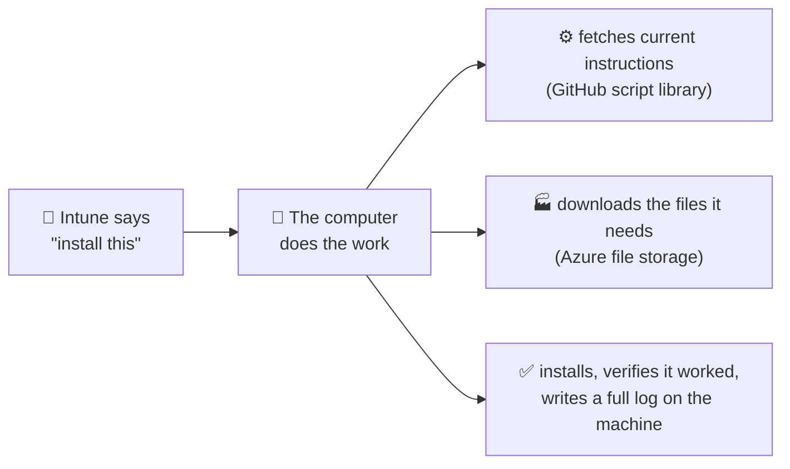

# PowerDeploy — Executive Overview

*One page, plain language. For the technical version, see [ARCHITECTURE.md](ARCHITECTURE.md).*

---

## What it is

PowerDeploy is a system, built in-house at the Santa Cruz County Office of Education, that installs and manages **printers and software** on our Windows computers — **without a print server, and without buying new per-device subscription software.**

## The problem it solves

Printing in most districts depends on an aging print server: a single machine that, when it fails, takes down printing for everyone, and that someone must keep patched, backed up, and licensed. The market offers two ways out — pay an annual per-device fee for a commercial cloud-printing service, or keep nursing the server. PowerDeploy is the third option: it uses the management tools the organization **already owns** (Microsoft Intune / Microsoft 365) to deliver printers and software directly to each computer, so there is no server left to fail.

## How it works — in one picture

Think of it like a car:

| Part | Role | What it actually is |
|---|---|---|
| 🔑 **The ignition** | Says "go" — nothing more | Microsoft Intune (which we already use to manage computers) |
| ⚙️ **The engine** | The current, version-controlled instructions | A script library on GitHub, with a full history of every change and who made it |
| 🏭 **The parts warehouse** | Holds the files: printer drivers, installers | Microsoft Azure file storage (costs a few dollars a month) |
| 🚗 **The car does the driving** | Downloads, installs, checks its own work, keeps a written record | **Each computer itself** |

## What it is *not* (the common misconceptions)

- **It is not a cloud service, and there is no "cloud computing" in it.** Nothing runs in the cloud. The cloud pieces are a file cabinet (Azure storage) and an instruction manual (GitHub). All the actual work happens on each computer.
- **There is no server** — nothing new to patch, back up, or fail over. If one computer has a problem, it affects that one computer.
- **There is no subscription or per-device fee.** The only new cost is file storage — a few dollars per month for the whole organization.
- **It does not touch student data.** It installs printers and applications; that is all it does.
- **It does not report anywhere.** Records of what was installed, when, and whether it worked stay on each machine, available for inspection.

## Is it safe?

- Computers can only **read** files from storage, using access links that **expire** and can be replaced on a schedule. Those links are kept in a locked area of Windows that only administrators can access.
- Every instruction a computer follows comes from a **version-controlled library with a complete change history** — we can always answer "what changed, when, and who changed it." Only authorized staff can change that library.
- Unlike the built-in deployment tools it replaces, PowerDeploy is **not a black box**: every step of every install is verified and written to a readable log. When something fails, we can see exactly why.

## Track record

Validated in a pilot group for seven months, approved for production in June 2026, and now running across the county office fleet. Adding a new printer or application takes an administrator a few minutes, and fixes reach every computer without repackaging or reimaging anything.

## What's next

The system does its job well; the current work is making it easier for *people*: better documentation, a guided setup process, and simpler screens for technicians — so that it can eventually be adopted by peer districts facing the same print-server problem, at no licensing cost (it is open source under the Apache 2.0 license, with SCCOE retaining its branding).

---

**Three questions we hear most:**

1. **"Is there a cloud compute cost we're not seeing?"** No. Nothing executes in the cloud, so there is nothing metered to pay for. The Azure bill is file storage only — single-digit dollars per month.
2. **"What happens if GitHub or Azure is unreachable?"** Nothing breaks. Printers and software already installed keep working — the system is only involved when something new is installed or repaired. New installs simply wait until the connection returns.
3. **"Who can change what gets installed on our computers?"** Only staff with write access to our script library and file storage — and every change is recorded with author, date, and content. We treat that access with the same care as any administrative credential.
